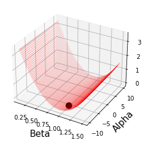

This is part of material when I worked as a graduate TA for General Econometrics (Ph.D level)

The whole point of this exercise is to understand each steps so that you can report estimated parameters and their standard errors. To do so, I assume that the readers know how to derive Euler moment conditions in equation (3).

1) We need to derive what is criterion function $J$\
2) Derive analytic population moment\
3) Obtain sample moment\
4) Load data set and estimate parameter

**Step 1) Let’s define criterion function $J(\beta, \alpha)$ with
population moment**:

$$argmax_{\beta, \alpha} \ J(\beta, \alpha) = E ({g}(\beta, \alpha)) ' \ W \ E ({g}(\beta, \alpha))$$

In sample moments:

$$argmax_{\beta, \alpha} \ J(\beta, \alpha) = T \times \bar{g}_T(\beta, \alpha) ' \ W \ \bar{g}_T(\beta, \alpha)$$

where

-   $\beta$ is a discount parameter that we want to estimate.

-   $\alpha$[^1] is a risk aversion parameter that we seek to recover.
    Theory tells us $\alpha \in [0,1]$

-   $\bar{g}_T$ is the sample moment.

-   $W$ is an weighting matrix. (Identity matrix in this problem set)[^2]

Equation (1) tells us that if we have sample moment ($ \bar{g}'_T$) and
$W$, we can recover parameter $\in (\beta, \alpha)$ by standard
optimization tool box. Since we already know that we will use $W = I$
(Identity matrix), the next step is to figure it out $E(g)$ with sample
moment $\bar{g}_T$.

**Step 2) Derive analytic population moment**:

To obtain population moment, we can appeal to either data generating
process, or economic theory. In this problem set, we start with Euler
equation such that

$$E_t [r_{t+1, j} \  MRS_{t+1}] = 1$$

where $j=1,...M $ asset (which is a portfolio), $t=1,..T$ denotes
monthly observations.

Replace MRS with substitution between $c_t$ and $c_{t+1}$ gives us:

$$\begin{aligned}
    E_t \Bigg[ r_{t+1, j} \  \beta \frac{u'(c_{t+1})}{u'(c_t)} \Bigg] &  = 1 \\
    E_t \Bigg[ \beta r_{t+1, j} \   \frac{u'(c_{t+1})}{u'(c_t)}   -1 \Bigg] &  = 0 \end{aligned}$$

Note that we have subscript $t$ over Expectation. $(E_t (\cdot))$ Let
$X^*_t$ denote all information set up to $1,... t$, we can write as
conditional expectation form:

$$E \Bigg[ \beta  r_{t+1, j} \   \frac{u'(c_{t+1})}{u'(c_t)} -1 \Bigg| X^*_t \Bigg] = 0$$

Note that we drop subscript $t$ anymore $E(\cdot)$.

Then we can use subset $X_t \subset X^*_t$ such that:

$$E \Bigg[ \beta  r_{t+1, j} \   \frac{u'(c_{t+1})}{u'(c_t)}  -1 \Bigg| X_t \Bigg] = 0$$

Our next goal is to convert “conditional expectation” into
“unconditional expectation”.

Claim:

$$E \Bigg[ \Bigg( \beta  r_{t+1, j} \   \frac{u'(c_{t+1})}{u'(c_t)}  -1 \Bigg) \otimes X_t \Bigg] = 0$$

where $\otimes$ represents the kronecker product.

Proof) Take law of iterated expectation over equation (7) gives us[^3]:

$$\underbrace{E \Bigg[ \Bigg( \beta  r_{t+1, j} \   \frac{u'(c_{t+1})}{u'(c_t)}  -1 \Bigg) \otimes X_t \Bigg]}_\text{equation (7)} \ = E \Bigg(   E \Bigg[ \Bigg( \beta  r_{t+1, j} \   \frac{u'(c_{t+1})}{u'(c_t)}  -1 \Bigg) \otimes X_t \Bigg| X_t \Bigg] \Bigg)$$

Appeal to distributive rule, it yields:

$$E \Bigg(   E \Bigg[ \Bigg( \beta  r_{t+1, j} \   \frac{u'(c_{t+1})}{u'(c_t)}  -1 \Bigg) \Bigg| X_t \ \otimes \underbrace{X_t \Big| X_t}_\text{ $X_t \Big| X_t = X_t $} \Bigg] \Bigg) \ =   E \Bigg(  \ \underbrace{E \Bigg[ \Bigg( \beta  r_{t+1, j} \   \frac{u'(c_{t+1})}{u'(c_t)}  -1  \Bigg| X_t \Bigg)}_\text{equation (6)} \ \otimes X_t \Bigg] \Bigg)$$

Note that underbrace is equal to zero by equation (6), which gives us
equation (9) is equal to zero.

Thus,

$$\underbrace{ E \Bigg[ \Bigg( \beta  r_{t+1, j} \   \frac{u'(c_{t+1})}{u'(c_t)}  -1 \Bigg) \otimes X_t \Bigg]}_\text{equation (7)} \ = \underbrace{E \Bigg(  \ \underbrace{E \Bigg[ \Bigg( \beta  r_{t+1, j} \   \frac{u'(c_{t+1})}{u'(c_t)}  -1  \Bigg| X_t \Bigg)}_\text{=0 by equation (6)} \ \otimes X_t \Bigg] \Bigg)   }_\text{equation (9)}   = 0$$

as we desired.

It gives us population moment as:

$$E \Bigg[ \Bigg( \beta  r_{t+1, j} \   \frac{u'(c_{t+1})}{u'(c_t)}  -1 \Bigg) \otimes X_t \Bigg] = 0$$

**Step 3) Derive sample moment**

In practice, information set ($X_t$) is not necessarily “economically
exogenous”. If we use lagged values from $\frac{c_{t+1}}{c_t}$ and
$r_{t+1, j}$, these would be valid instruments.

Suppose that we use information set as two lagged values for non durable
goods, and 1 year treasury bond. $X_t$ looks like:

$$X_t =  \underbrace{\Bigg[ \frac{c_t}{c_{t-1}}, \ \frac{c_{t-1}}{c_{t-2}},\   r_{t, j}, \ r_{t-1, j}  \Bigg]}_\text{1 * 4}$$

Note that I use one dimensional consumption (non-durable goods) and one
type of return, which is 1 year treasury bond with two lags (first lag,
and second lag).

I will use CRRA utility function as:

$$\begin{aligned}
    u(c_t) &  = \frac{c_t^{1-\alpha}}{1-\alpha} \\
    u'(c_t) & = c_t^{-\alpha}\end{aligned}$$

In a summary, sample moment $\bar{g}_T$ with one dimensional consumption
(non-durable goods), one type of return $(j=1)$, and information with
two lags (consumption and 1 year treasury bonds) will be given by:

$$\underbrace{ \bar{g}_T}_\text{1 * 4} \ = \frac{1}{T} \sum_{t=1}^T \underbrace{ \Bigg( \underbrace{\Big[ \beta \ r_{t+1, j} \Big( \frac{c_{t+1}}{c_t} \Big) ^{-\alpha} -1 \Big]}_\text{1 * 1} \otimes  \Bigg[ \underbrace{ \frac{c_t}{c_{t-1}}, \ \frac{c_{t-1}}{c_{t-2}},  \ r_{t, j},\  r_{t-1, j}  \Bigg] }_\text{1 * 4} \Bigg) }_\text{ 1 $\otimes$ 4  = 1 * 4}$$

Criterion function $J$ with $\bar{g}_T $ will be given by:

$$\underbrace{J}_\text{1 * 1} \ = T * \underbrace{\underbrace{\bar{g}'_T}_\text{1*4} \ \underbrace{W}_\text{4*4} \ \underbrace{\bar{g}_T}_\text{4*1}}_\text{1*1}$$

**Step 4) Load data set and estimate parameter**

```python
# Import packages and load the data
import numpy as np
import pandas as pd
import numpy.linalg as lin
import scipy.stats as sts
import scipy.integrate as intgr
import scipy.optimize as opt
import matplotlib.pyplot as plt
from mpl_toolkits.mplot3d import Axes3D
from matplotlib import cm
%matplotlib inline

from scipy.optimize import minimize
# This next command is specifically for Jupyter Notebook
%matplotlib notebook

dir_data = "/Users/jinkim/Dropbox/2020 Spring/General Econometrics/PS/PS5 - GMM/temp-GMM/"
df = pd.read_stata(dir_data+'merge_temp1.dta')
```


```python
df.head()
print(len(df))
```

    240


```python
# Drop 1959 January /February since we use lagged variables.

df1 = df.dropna()
print(len(df1))
```

    238


```python
# Collect data

instruments = df1[['ratio_nd_1','ratio_nd_2', 'return_bond_1', 'return_bond_2']].values
c_1 = df1.ratio_nd.values.tolist()
return_bond = df1.return_bond.values.tolist()

# Parameter example
beta = 0.9
alpha = -0.5
```


```python
# Define Euler equation moments

def sample_1(beta, alpha, t, return_bond, c_1):
    return  beta * (return_bond[t]*c_1[t]**(alpha)) -1
```


```python
# Define GMM moments

def sample_moment(beta, alpha, return_bond, c_1,instruments):
    
    T = len(df1)

    temp_matrix = np.zeros((len(df1), len(instruments.T)))
    
    for t in range (0,T):

        sample = np.array([sample_1(beta, alpha,t,return_bond, c_1) ])
        temp_matrix[t] = np.kron(sample, instruments[t,:])

    # sum over column and divide by T
    g_m = (1/T)*temp_matrix.sum(axis=0)
    return g_m

def moment(x, W, return_bond, c_1,instruments):
    
    beta=x[0]
    alpha=x[1]

    g = sample_moment(beta, alpha,return_bond, c_1,instruments)

    return np.matmul(np.matmul(g,W),g)
```


```python
# Value example

W=np.identity(len(sample_moment(beta, alpha, return_bond, c_1,instruments)))
print(W)

moment( [1,-0.5], W,return_bond, c_1,instruments)
```

    [[1. 0. 0. 0.]
     [0. 1. 0. 0.]
     [0. 0. 1. 0.]
     [0. 0. 0. 1.]]


    0.01059379064510586


```python
res = minimize(moment, [0,0], args = (W,return_bond, c_1,instruments), method='Nelder-Mead', options={'xatol': 1e-7, 'disp': True, 'maxiter': 10000})
res.x
```

    Optimization terminated successfully.
             Current function value: 0.000000
             Iterations: 163
             Function evaluations: 304
    Beta 0.9562674218273375 Alpha -4.5521339157822975


```python
print('Beta', res.x[0], 'Alpha', res.x[1])
```

### Under limited data, alpha values seems to be little bit further from Hansen and Singleton (1982)
### I want to check how moments are smooth around parameters:

#### I create a 100 by 100 line space and their moment values.


```python
N = 100
x = np.linspace(0.1, 1.5, N)
y = np.linspace(-10, 10, N)

Mat =  np.zeros((len(x), len(y)))
```


```python
for i in range(0,len(x)):
    for j in range(0,len(y)):
        Mat[i,j] = moment([x[i],y[j]], W,return_bond, c_1,instruments )
```


```python
def duplicate_x(testList, n):
    return [ele for ele in testList for _ in range(n)]
x_replicate = duplicate_x(x, N)
print(len(x_replicate))


y_replicate_temp = duplicate_x([y],N)

y_replicate = []
for sublist in y_replicate_temp:
    for item in sublist:
        y_replicate.append(item)
```

    10000


### Beta value is minimized around 1.00 and alpha is pretty flat.
### If you want to take a closer look, please see discussions in [Errata](http://www.e-m-h.org/HaSi84.pdf), and [this link](https://ocw.mit.edu/courses/economics/14-382-econometrics-spring-2017/lecture-notes/MIT14_382S17_lec4.pdf)


```python
%matplotlib inline
fig = plt.figure()
ax = fig.add_subplot(111, projection='3d')

ax.plot([x[68]], [y[12]], [Mat[49,0]], markerfacecolor='k', markeredgecolor='k', marker='o', markersize=10, alpha=1)
plt.xlabel('Beta', fontsize=15)
plt.ylabel('Alpha', fontsize=15)
ax.scatter(x_replicate, y_replicate, Mat, c='r', marker='o', s=0.02)
```


    <mpl_toolkits.mplot3d.art3d.Path3DCollection at 0x7fe581b34190>


    

   


[^1]: $\gamma = 1-\alpha$ in the paper, I will keep use $\alpha$ from now.
[^2]: For exposition, I assume $W=I$, and one might want to use two-step GMM.
[^3]: I do not use properties that equation (7) is equal to zero
